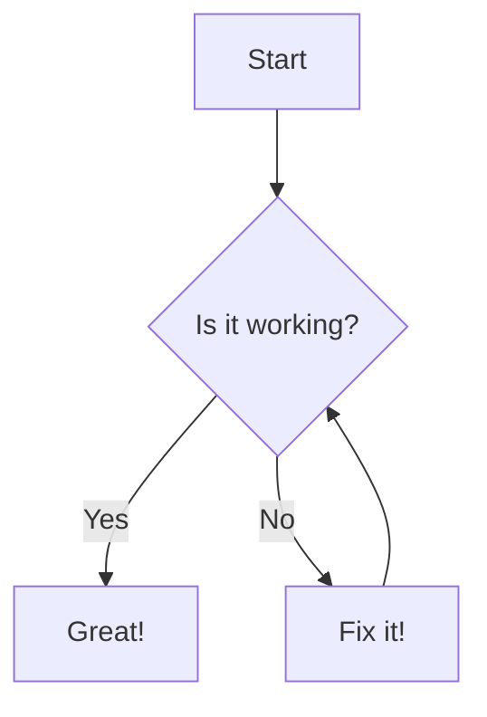
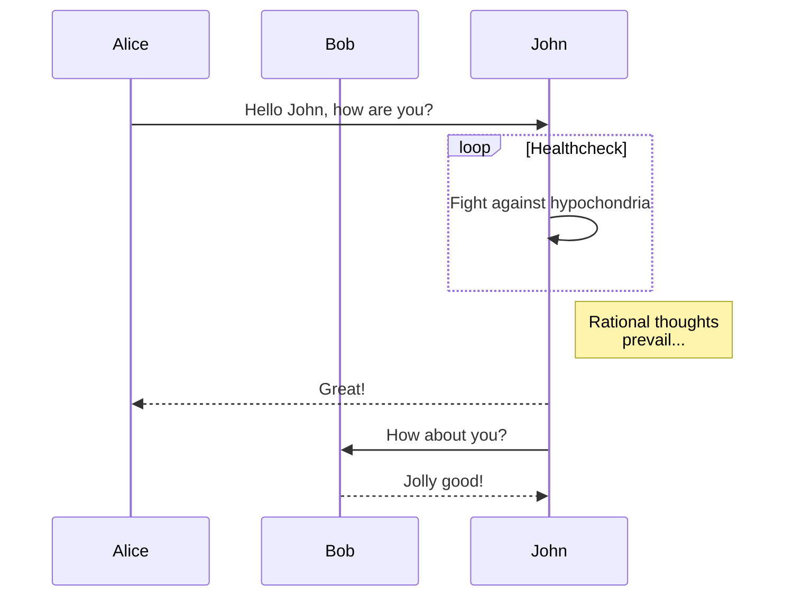

# Getting Started

Welcome to the getting started guide! This document provides a comprehensive overview of how to use this documentation and demonstrates various Markdown features.

## Code Blocks

```csharp
using Foo.Bar.Baz;

namespace Foo.Api;

public static class Sitemap
{
    [AttributeUsage(AttributeTargets.Class, Inherited = false)]
    public class PriorityAttribute(double priority) : Attribute
    {
        public double Priority { get; } = priority;
    }

    [AttributeUsage(AttributeTargets.Class, Inherited = false)]
    public class ChangeFreqAttribute(SitemapChangeFreq changeFreq) : Attribute
    {
        public SitemapChangeFreq ChangeFreq { get; } = changeFreq;
    }   
    
    [AttributeUsage(AttributeTargets.Class, Inherited = false)]
    public class LastModAttribute(int year, int month, int day) : Attribute
    {
        public int Year => year;
        public int Month => month;
        public int Day => day;

        public override string ToString() => $"{Year}-{Month:00}-{Day:00}";
    }
}

public enum SitemapChangeFreq
{
    Always,
    Hourly,
    Daily,
    Weekly,
    Monthly,
    Yearly,
    Never
}
```

## Text Formatting & Emojis

This section showcases various text formatting options available in Markdown.

- **Bold text**: **This is bold text**
- *Italic text*: *This is italic text*
- ~~Strikethrough~~: ~~This text is struck through~~
- <u>Underlined text</u>: <u>This text is underlined</u>
- <mark>Highlighted text</mark>: <mark>This text is highlighted</mark>
- <abbr title="HyperText Markup Language">HTML</abbr>: Hover over this text.
- Keyboard input: Use <kbd>Ctrl</kbd> + <kbd>C</kbd>.
- Emojis: :rocket: :tada: :warning:
- Subscript: H~2~O
- Superscript: x^2^
- ++Inserted text++
- ==Marked text==

## Alerts

Use alerts to draw attention to important information.

::: note
This is a note alert.
:::

::: tip
This is a tip alert.
:::

::: warning
This is a warning alert.
:::

::: danger
This is a danger alert.
:::

## Diagrams (Mermaid)

Create diagrams using Mermaid syntax.

### Flowchart



### Sequence Diagram



^^ This is a footer
^^ multi-line

## Mathematical Formulas (KaTeX)

You can write mathematical formulas using LaTeX syntax.

- Inline formula: $E = mc^2$
- Display formula: $$ \int_a^b f(x) \, dx = F(b) - F(a) $$

## Custom Containers

Use custom containers to draw attention to important information.

::: tip
This is a tip. It's a great way to provide helpful advice.
:::

::: warning
This is a warning. Use it to indicate something that requires caution.
:::

## Collapsible Sections

<details>
  <summary>Click to expand</summary>
  
  This is the content that was hidden.
  
</details>

## Embedded Media

[//]: # (![youtube]&#40;https://www.youtube.com/watch?v=dQw4w9WgXcQ&#41;)

## Figures & Images

[//]: # (![Placeholder Image]&#40;https://via.placeholder.com/600x200 "This is a caption for the image above."&#41;)

## Blockquotes

> This is a simple blockquote.

## Lists

- Item 1
- Item 2
- [ ] Task list item
- [x] Completed task list item

## Advanced Tables

| Column 1 | Column 2 |
|:---------|:----------:|
| Left     |   Center   |

## Definition Lists

Term 1
: Definition 1

Term 2
: Definition 2

## Citations

This is a citation. [@markdownguide]

## Footnotes

Footnotes are useful for adding extra information.[^1]

[^1]: This is the footnote content.
[@markdownguide]: https://www.markdownguide.org

---
Footer content can be added here.
---

## Links

- [Internal Link](./another-page)
- [External Link to Google](https://www.google.com)
